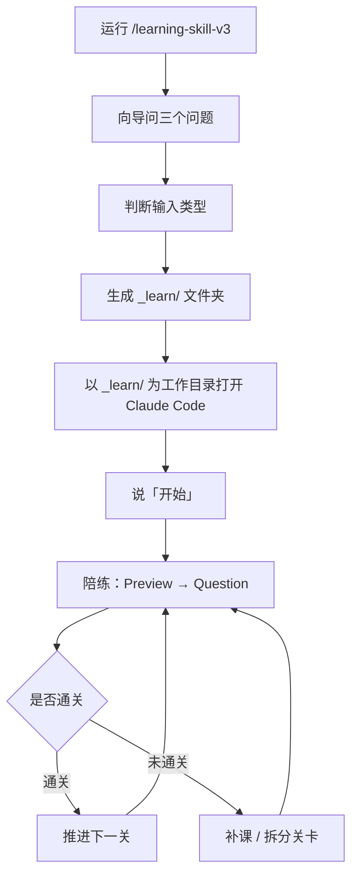

# learning-skill-v3

> 把「我想学 X」变成一个可持续推进、可检查掌握、可回头复习的一对一学习系统。

[](#)
[](#使用方式)
[](#)
[](LICENSE)

## 一句话介绍

这是一个用于 Claude Code 的学习 Skill。它不是一次性生成课程大纲，而是让 Agent 像一位长期学习教练一样：

- **向导**：初始化学习环境，生成课程卡或知识点清单
- **陪练**：按关卡推进，Preview → Question → Explain → Feedback
- **督导**：收工记录，知识库归档

## 支持的学习类型

| 输入类型 | 触发方式 | 生成文件 |
| --- | --- | --- |
| Git 项目 / 代码库 | 提供项目路径 | 课程卡.md |
| 结构化文档（书/PDF） | 提供文档路径或内容 | 课程卡.md |
| AI 生成课（从零学主题） | 描述主题 + 目标 | 课程卡.md |
| 碎片型（文章/逐字稿） | 粘贴内容或本地路径 | 知识点清单.md |
| 跑通型（让项目跑起来） | 「帮我跑通 X」 | 跑通指南.md |
| 临时追问 | 随时问一个概念 | 不生成文件，直接对话 |

## 学习流程



## 使用方式

**第一步：初始化（一次性）**

在本仓库打开 Claude Code，运行 Skill：

```
/learning-skill-v3
```

向导会询问：
1. 你想学什么？（项目路径 / 文档 / 主题名）
2. 你目前对它了解多少？
3. 学习目标是什么？

然后在目标位置生成 `_learn/` 文件夹及全部学习文件。

**第二步：每次学习**

关闭本仓库，以 `_learn/` 为工作目录重新打开 Claude Code：

```bash
cd [项目路径]/_learn
claude
```

说「开始」，陪练自动读取课程卡，进入学习循环。

## 仓库结构

```text
learning-plan-skill/
├── README.md
├── CLAUDE.md                        # 仓库说明（Claude Code 项目指令）
├── DESIGN.md                        # 系统设计文档
├── 使用方法.md                       # 用户快速上手指南
├── learning-skill-v3/
│   ├── SKILL.md                     # 向导 Skill 定义
│   ├── agents/
│   │   └── claude.yaml
│   └── templates/
│       ├── _learn/
│       │   ├── CLAUDE.md            # 陪练行为定义
│       │   ├── guide.md             # 向导归档能力
│       │   ├── supervisor.md        # 督导收工能力
│       │   ├── 课程卡.md            # 项目型模板
│       │   ├── 知识点清单.md        # 碎片型模板
│       │   ├── 跑通指南.md          # 跑通型模板
│       │   ├── 错题本.md
│       │   └── 进度日志.md
│       └── kb/
│           ├── _index.md            # 知识库索引模板
│           ├── node.md              # 知识节点模板
│           └── 学习计划表.md
└── LICENSE
```

## 三大教学原则

| 原则 | 在 Skill 里的体现 |
| --- | --- |
| 费曼技巧 | 用简单语言、类比和真实场景解释复杂概念 |
| 苏格拉底式提问 | 用追问引导学习者自己推导，而不是直接给答案 |
| 脚手架原则 | 从已知推向未知，每一步建立在前一步之上 |

通关标准：能用自己的话说出「做什么 · 为什么 · 边界在哪」（30-80 字）。

## 设计文档

系统的完整设计（角色职责、数据流、文件结构）见 [DESIGN.md](DESIGN.md)。

## 许可证

MIT License。详见 [LICENSE](LICENSE)。
